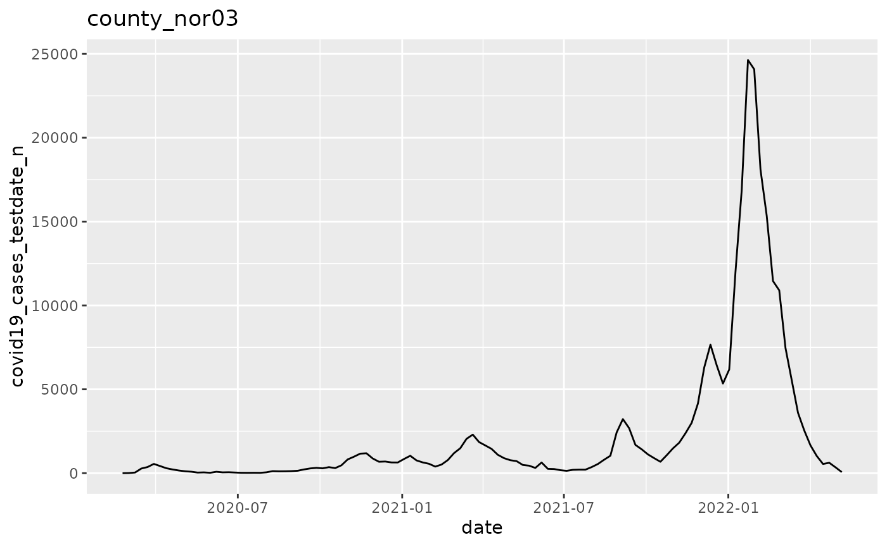
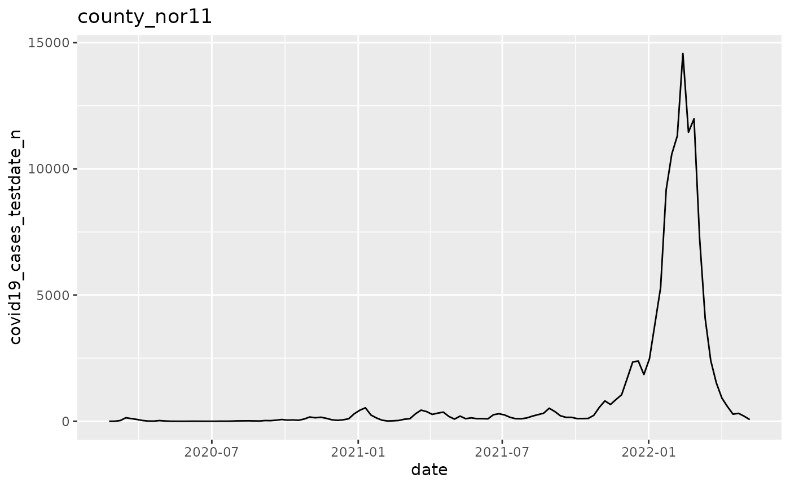
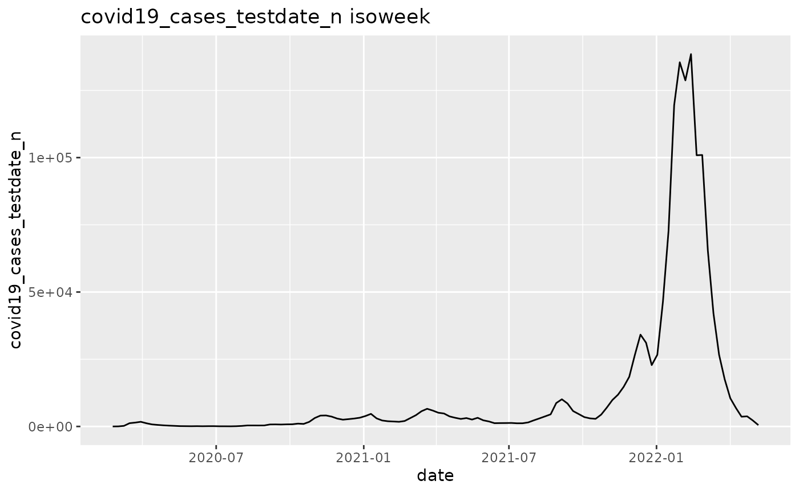
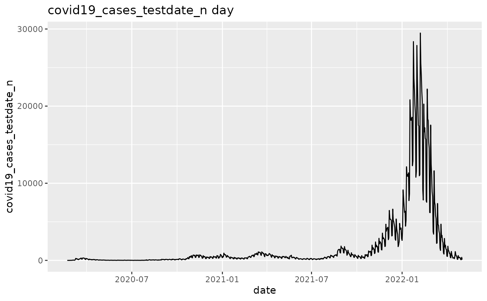
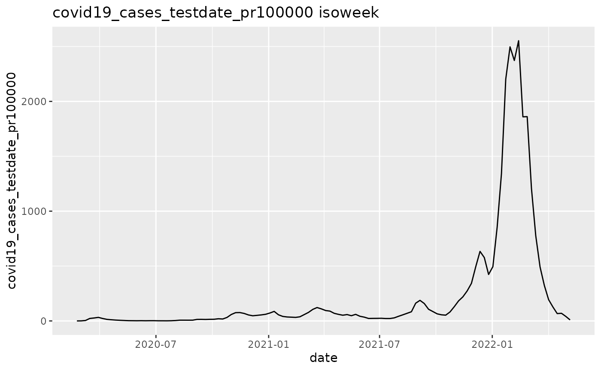
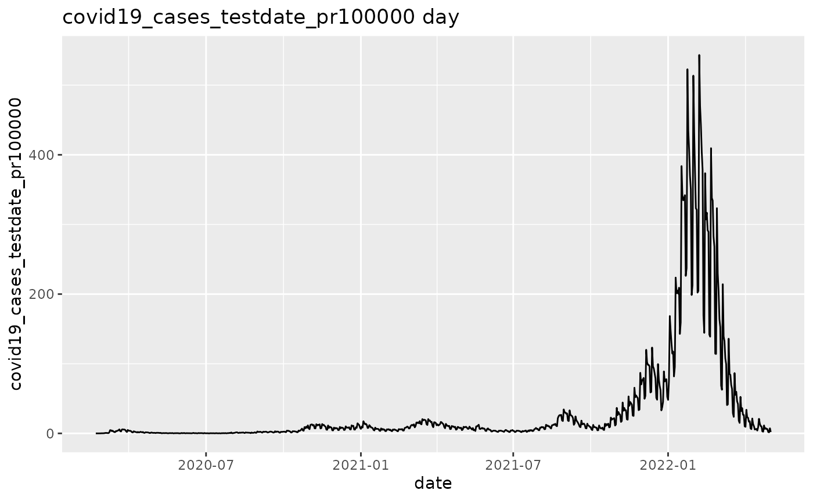
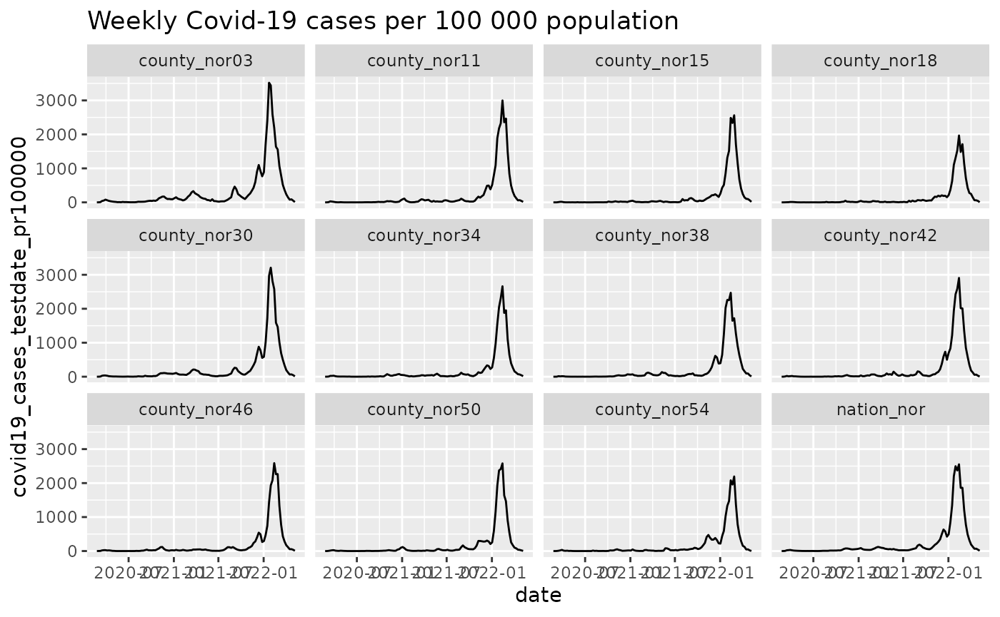
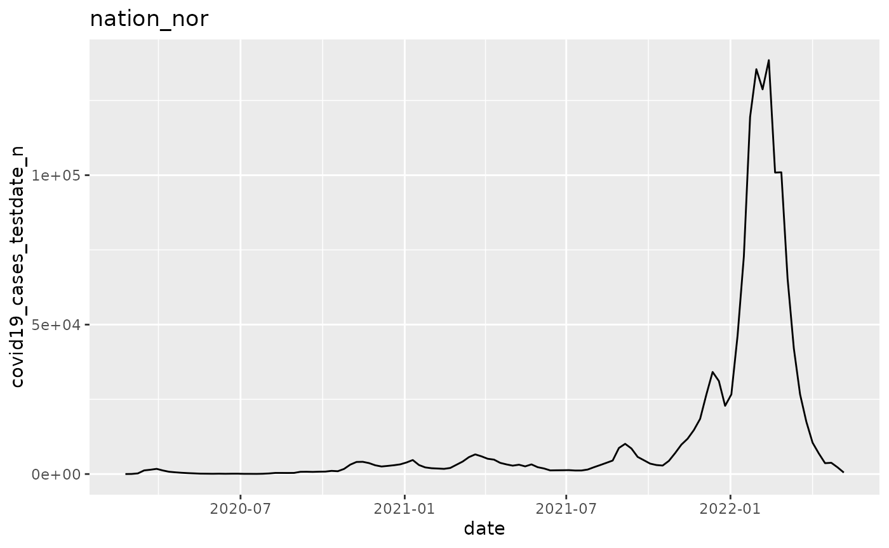

# Adding analyses to a plan

## Core Concepts

### Broad technical terms

[TABLE]

### Different types of plans

|                      |                                                                                                  |
|----------------------|--------------------------------------------------------------------------------------------------|
| **Plan Type**        | **Description**                                                                                  |
| Single-function plan | Same action function applied multiple times with different argsets applied to the same datasets. |
| Multi-function plan  | Different action functions applied to the same datasets.                                         |

### Plan Examples

|                      |                                                                                                                                                                     |
|----------------------|---------------------------------------------------------------------------------------------------------------------------------------------------------------------|
| **Plan Type**        | **Example**                                                                                                                                                         |
| Single-function plan | Multiple strata (e.g. locations, age groups) that you need to apply the same function to to (e.g. outbreak detection, trend detection, graphing).                   |
| Single-function plan | Multiple variables (e.g. multiple outcomes, multiple exposures) that you need to apply the same statistical methods to (e.g. regression models, correlation plots). |
| Multi-function plan  | Creating the output for a report (e.g. multiple different tables and graphs).                                                                                       |

## Single-function plan

Use this approach in one of these two cases:

- You have multiple strata (e.g. locations, age groups) that you need to
  apply the same statistical methods to.
- You have multiple variables (e.g. multiple exposures, multiple
  outcomes) that you want to apply the same statistical methods to.

When you apply the same function multiple times, add the argsets first.
Then apply the analysis function, just before you run the analyses.

### Multiple strata

This example loops through multiple geographical locations. It applies a
graphing function to the data from each of those locations.

``` r
library(ggplot2)
library(data.table)
```

    ## 
    ## Attaching package: 'data.table'

    ## The following object is masked from 'package:base':
    ## 
    ##     %notin%

``` r
library(magrittr)

# We begin by defining a new plan
p <- plnr::Plan$new()

# Data function
data_fn <- function(){
  return(plnr::nor_covid19_cases_by_time_location)
}

# We add sources of data
# We can add data directly
p$add_data(
  name = "covid19_cases",
  fn_name = "data_fn"
)

p$get_data()
```

    ## $covid19_cases
    ##        granularity_time granularity_geo country_iso3 location_code border
    ##                  <char>          <char>       <char>        <char>  <int>
    ##     1:              day          county          nor  county_nor03   2020
    ##     2:              day          county          nor  county_nor03   2020
    ##     3:              day          county          nor  county_nor03   2020
    ##     4:              day          county          nor  county_nor03   2020
    ##     5:              day          county          nor  county_nor03   2020
    ##    ---                                                                   
    ## 11024:          isoweek          nation          nor    nation_nor   2020
    ## 11025:          isoweek          nation          nor    nation_nor   2020
    ## 11026:          isoweek          nation          nor    nation_nor   2020
    ## 11027:          isoweek          nation          nor    nation_nor   2020
    ## 11028:          isoweek          nation          nor    nation_nor   2020
    ##           age    sex isoyear isoweek isoyearweek    season seasonweek calyear
    ##        <char> <char>   <int>   <int>      <char>    <char>      <num>   <int>
    ##     1:  total  total    2020       8     2020-08 2019/2020         31    2020
    ##     2:  total  total    2020       8     2020-08 2019/2020         31    2020
    ##     3:  total  total    2020       8     2020-08 2019/2020         31    2020
    ##     4:  total  total    2020       9     2020-09 2019/2020         32    2020
    ##     5:  total  total    2020       9     2020-09 2019/2020         32    2020
    ##    ---                                                                       
    ## 11024:  total  total    2022      14     2022-14 2021/2022         37      NA
    ## 11025:  total  total    2022      15     2022-15 2021/2022         38      NA
    ## 11026:  total  total    2022      16     2022-16 2021/2022         39      NA
    ## 11027:  total  total    2022      17     2022-17 2021/2022         40      NA
    ## 11028:  total  total    2022      18     2022-18 2021/2022         41      NA
    ##        calmonth calyearmonth       date covid19_cases_testdate_n
    ##           <int>       <char>     <Date>                    <int>
    ##     1:        2     2020-M02 2020-02-21                        0
    ##     2:        2     2020-M02 2020-02-22                        0
    ##     3:        2     2020-M02 2020-02-23                        0
    ##     4:        2     2020-M02 2020-02-24                        0
    ##     5:        2     2020-M02 2020-02-25                        0
    ##    ---                                                          
    ## 11024:       NA         <NA> 2022-04-10                     6888
    ## 11025:       NA         <NA> 2022-04-17                     3635
    ## 11026:       NA         <NA> 2022-04-24                     3764
    ## 11027:       NA         <NA> 2022-05-01                     2243
    ## 11028:       NA         <NA> 2022-05-08                      502
    ##        covid19_cases_testdate_pr100000
    ##                                  <num>
    ##     1:                        0.000000
    ##     2:                        0.000000
    ##     3:                        0.000000
    ##     4:                        0.000000
    ##     5:                        0.000000
    ##    ---                                
    ## 11024:                      126.961423
    ## 11025:                       67.001274
    ## 11026:                       69.379036
    ## 11027:                       41.343564
    ## 11028:                        9.252996
    ## 
    ## $hash
    ## $hash$current
    ## [1] "cbb5d442160f26df4c2d9a4fec794fd7"
    ## 
    ## $hash$current_elements
    ## $hash$current_elements$covid19_cases
    ## [1] "7f1b0a581386e75e907bffd94938a3a7"

``` r
location_codes <- p$get_data()$covid19_cases$location_code %>%
  unique() %>% 
  print()
```

    ##  [1] "county_nor03" "county_nor11" "county_nor15" "county_nor18" "county_nor30"
    ##  [6] "county_nor34" "county_nor38" "county_nor42" "county_nor46" "county_nor50"
    ## [11] "county_nor54" "nation_nor"

``` r
p$add_argset_from_list(
  plnr::expand_list(
    location_code = location_codes,
    granularity_time = "isoweek"
  )
)
# Examine the argsets that are available
p$get_argsets_as_dt()
```

    ##                            name_analysis index_analysis location_code
    ##                                   <char>          <int>        <list>
    ##  1: 91963d1a-82ed-435a-ac24-d81524b587a6              1  county_nor03
    ##  2: 2cd9f1f3-d22a-4cfc-9960-2c1b1b76f998              2  county_nor11
    ##  3: 91fec43e-c3b5-447e-b870-b446cf2c4e57              3  county_nor15
    ##  4: caacd4eb-1664-40b6-95f1-b48ee6730820              4  county_nor18
    ##  5: b596d200-00ff-4c53-af5b-0dd035680a18              5  county_nor30
    ##  6: a456e641-8d3f-42d7-ac8b-61fbb03fe70d              6  county_nor34
    ##  7: e9fc2c90-b1c6-49f3-8d07-8e211b685bc6              7  county_nor38
    ##  8: f147f2ae-642f-4dd3-b961-b3b7be9316c1              8  county_nor42
    ##  9: bed209e7-dae0-4de1-b7f3-bcafa0ab7b54              9  county_nor46
    ## 10: 9e41567f-6222-45f4-87ac-db03087047d0             10  county_nor50
    ## 11: 827110d0-eee0-42c9-bcb1-74cae7926af7             11  county_nor54
    ## 12: 8a10662a-8699-416b-8491-184ba0e7dfc7             12    nation_nor
    ##     granularity_time
    ##               <list>
    ##  1:          isoweek
    ##  2:          isoweek
    ##  3:          isoweek
    ##  4:          isoweek
    ##  5:          isoweek
    ##  6:          isoweek
    ##  7:          isoweek
    ##  8:          isoweek
    ##  9:          isoweek
    ## 10:          isoweek
    ## 11:          isoweek
    ## 12:          isoweek

``` r
# We can then add a simple analysis that returns a figure:

# To do this, we first need to create an action function
# (takes two arguments -- data and argset)
action_fn <- function(data, argset){
  if(plnr::is_run_directly()){
    data <- p$get_data()
    argset <- p$get_argset(1)
  }
  pd <- data$covid19_cases[
    location_code == argset$location_code &
    granularity_time == argset$granularity_time
  ]
  
  q <- ggplot(pd, aes(x=date, y=covid19_cases_testdate_n))
  q <- q + geom_line()
  q <- q + labs(title = argset$location_code)
  q
}

p$apply_action_fn_to_all_argsets(fn_name = "action_fn")

p$run_one(1)
```



``` r
q <- p$run_all()
q[[1]]
```


``` r
q[[2]]
```



### Multiple variables

This example loops through multiple variable combinations. The
combinations cross two choices:

1.  raw numbers of Covid-19 cases, against Covid-19 cases per 100 000
    population;
2.  aggregation over isoweek, against aggregation over day.

The example then applies a graphing function to the data for each
combination.

``` r
library(ggplot2)
library(data.table)
library(magrittr)

# We begin by defining a new plan
p <- plnr::Plan$new()

# Data function
data_fn <- function(){
  return(plnr::nor_covid19_cases_by_time_location[location_code=="nation_nor"])
}

# We add sources of data
# We can add data directly
p$add_data(
  name = "covid19_cases",
  fn_name = "data_fn"
)

p$get_data()
```

    ## $covid19_cases
    ##      granularity_time granularity_geo country_iso3 location_code border    age
    ##                <char>          <char>       <char>        <char>  <int> <char>
    ##   1:              day          nation          nor    nation_nor   2020  total
    ##   2:              day          nation          nor    nation_nor   2020  total
    ##   3:              day          nation          nor    nation_nor   2020  total
    ##   4:              day          nation          nor    nation_nor   2020  total
    ##   5:              day          nation          nor    nation_nor   2020  total
    ##  ---                                                                          
    ## 915:          isoweek          nation          nor    nation_nor   2020  total
    ## 916:          isoweek          nation          nor    nation_nor   2020  total
    ## 917:          isoweek          nation          nor    nation_nor   2020  total
    ## 918:          isoweek          nation          nor    nation_nor   2020  total
    ## 919:          isoweek          nation          nor    nation_nor   2020  total
    ##         sex isoyear isoweek isoyearweek    season seasonweek calyear calmonth
    ##      <char>   <int>   <int>      <char>    <char>      <num>   <int>    <int>
    ##   1:  total    2020       8     2020-08 2019/2020         31    2020        2
    ##   2:  total    2020       8     2020-08 2019/2020         31    2020        2
    ##   3:  total    2020       8     2020-08 2019/2020         31    2020        2
    ##   4:  total    2020       9     2020-09 2019/2020         32    2020        2
    ##   5:  total    2020       9     2020-09 2019/2020         32    2020        2
    ##  ---                                                                         
    ## 915:  total    2022      14     2022-14 2021/2022         37      NA       NA
    ## 916:  total    2022      15     2022-15 2021/2022         38      NA       NA
    ## 917:  total    2022      16     2022-16 2021/2022         39      NA       NA
    ## 918:  total    2022      17     2022-17 2021/2022         40      NA       NA
    ## 919:  total    2022      18     2022-18 2021/2022         41      NA       NA
    ##      calyearmonth       date covid19_cases_testdate_n
    ##            <char>     <Date>                    <int>
    ##   1:     2020-M02 2020-02-21                        1
    ##   2:     2020-M02 2020-02-22                        0
    ##   3:     2020-M02 2020-02-23                        0
    ##   4:     2020-M02 2020-02-24                        0
    ##   5:     2020-M02 2020-02-25                        0
    ##  ---                                                 
    ## 915:         <NA> 2022-04-10                     6888
    ## 916:         <NA> 2022-04-17                     3635
    ## 917:         <NA> 2022-04-24                     3764
    ## 918:         <NA> 2022-05-01                     2243
    ## 919:         <NA> 2022-05-08                      502
    ##      covid19_cases_testdate_pr100000
    ##                                <num>
    ##   1:                      0.01863037
    ##   2:                      0.00000000
    ##   3:                      0.00000000
    ##   4:                      0.00000000
    ##   5:                      0.00000000
    ##  ---                                
    ## 915:                    126.96142312
    ## 916:                     67.00127367
    ## 917:                     69.37903551
    ## 918:                     41.34356447
    ## 919:                      9.25299570
    ## 
    ## $hash
    ## $hash$current
    ## [1] "0ad573d37712f0a8ab666846d1b721a1"
    ## 
    ## $hash$current_elements
    ## $hash$current_elements$covid19_cases
    ## [1] "07cc51795bccaf2afebe48619ce87227"

``` r
p$add_argset_from_list(
  plnr::expand_list(
    variable = c("covid19_cases_testdate_n", "covid19_cases_testdate_pr100000"),
    granularity_time = c("isoweek","day")
  )
)
# Examine the argsets that are available
p$get_argsets_as_dt()
```

    ##                           name_analysis index_analysis
    ##                                  <char>          <int>
    ## 1: b28cca08-367f-40d2-815e-68e4bf8f4cef              1
    ## 2: b18d7e4a-cb9d-46df-b939-9d0a9308f3b5              2
    ## 3: 1d1d2bc0-d58b-4e52-b942-cdcf016e15ff              3
    ## 4: 16698bf5-b2f0-467b-8f21-2ee224da9d8f              4
    ##                           variable granularity_time
    ##                             <list>           <list>
    ## 1:        covid19_cases_testdate_n          isoweek
    ## 2:        covid19_cases_testdate_n              day
    ## 3: covid19_cases_testdate_pr100000          isoweek
    ## 4: covid19_cases_testdate_pr100000              day

``` r
# We can then add a simple analysis that returns a figure:

# To do this, we first need to create an action function
# (takes two arguments -- data and argset)
action_fn <- function(data, argset){
  if(plnr::is_run_directly()){
    data <- p$get_data()
    argset <- p$get_argset(1)
  }
  pd <- data$covid19_cases[
    granularity_time == argset$granularity_time
  ]
  
  q <- ggplot(pd, aes_string(x="date", y=argset$variable))
  q <- q + geom_line()
  q <- q + labs(title = argset$granularity_time)
  q
}

p$apply_action_fn_to_all_argsets(fn_name = "action_fn")

p$run_one(1)
```

    ## Warning: `aes_string()` was deprecated in ggplot2 3.0.0.
    ## ℹ Please use tidy evaluation idioms with `aes()`.
    ## ℹ See also `vignette("ggplot2-in-packages")` for more information.
    ## This warning is displayed once per session.
    ## Call `lifecycle::last_lifecycle_warnings()` to see where this warning was
    ## generated.



``` r
p$run_one(2)
```



``` r
p$run_one(3)
```



``` r
p$run_one(4)
```



## Multi-function plan

Use this approach when you create the output for a report, and you need
multiple different tables and graphs.

``` r
library(ggplot2)
library(data.table)
library(magrittr)

# We begin by defining a new plan
p <- plnr::Plan$new()

# Data function
data_fn <- function(){
  return(plnr::nor_covid19_cases_by_time_location)
}

# We add sources of data
# We can add data directly
p$add_data(
  name = "covid19_cases",
  fn_name = "data_fn"
)

p$get_data()
```

    ## $covid19_cases
    ## Indices: <granularity_time__location_code>, <location_code>
    ##        granularity_time granularity_geo country_iso3 location_code border
    ##                  <char>          <char>       <char>        <char>  <int>
    ##     1:              day          county          nor  county_nor03   2020
    ##     2:              day          county          nor  county_nor03   2020
    ##     3:              day          county          nor  county_nor03   2020
    ##     4:              day          county          nor  county_nor03   2020
    ##     5:              day          county          nor  county_nor03   2020
    ##    ---                                                                   
    ## 11024:          isoweek          nation          nor    nation_nor   2020
    ## 11025:          isoweek          nation          nor    nation_nor   2020
    ## 11026:          isoweek          nation          nor    nation_nor   2020
    ## 11027:          isoweek          nation          nor    nation_nor   2020
    ## 11028:          isoweek          nation          nor    nation_nor   2020
    ##           age    sex isoyear isoweek isoyearweek    season seasonweek calyear
    ##        <char> <char>   <int>   <int>      <char>    <char>      <num>   <int>
    ##     1:  total  total    2020       8     2020-08 2019/2020         31    2020
    ##     2:  total  total    2020       8     2020-08 2019/2020         31    2020
    ##     3:  total  total    2020       8     2020-08 2019/2020         31    2020
    ##     4:  total  total    2020       9     2020-09 2019/2020         32    2020
    ##     5:  total  total    2020       9     2020-09 2019/2020         32    2020
    ##    ---                                                                       
    ## 11024:  total  total    2022      14     2022-14 2021/2022         37      NA
    ## 11025:  total  total    2022      15     2022-15 2021/2022         38      NA
    ## 11026:  total  total    2022      16     2022-16 2021/2022         39      NA
    ## 11027:  total  total    2022      17     2022-17 2021/2022         40      NA
    ## 11028:  total  total    2022      18     2022-18 2021/2022         41      NA
    ##        calmonth calyearmonth       date covid19_cases_testdate_n
    ##           <int>       <char>     <Date>                    <int>
    ##     1:        2     2020-M02 2020-02-21                        0
    ##     2:        2     2020-M02 2020-02-22                        0
    ##     3:        2     2020-M02 2020-02-23                        0
    ##     4:        2     2020-M02 2020-02-24                        0
    ##     5:        2     2020-M02 2020-02-25                        0
    ##    ---                                                          
    ## 11024:       NA         <NA> 2022-04-10                     6888
    ## 11025:       NA         <NA> 2022-04-17                     3635
    ## 11026:       NA         <NA> 2022-04-24                     3764
    ## 11027:       NA         <NA> 2022-05-01                     2243
    ## 11028:       NA         <NA> 2022-05-08                      502
    ##        covid19_cases_testdate_pr100000
    ##                                  <num>
    ##     1:                        0.000000
    ##     2:                        0.000000
    ##     3:                        0.000000
    ##     4:                        0.000000
    ##     5:                        0.000000
    ##    ---                                
    ## 11024:                      126.961423
    ## 11025:                       67.001274
    ## 11026:                       69.379036
    ## 11027:                       41.343564
    ## 11028:                        9.252996
    ## 
    ## $hash
    ## $hash$current
    ## [1] "0306cac791d5f990073167e17ed15f9b"
    ## 
    ## $hash$current_elements
    ## $hash$current_elements$covid19_cases
    ## [1] "bad75e8e213b3de3eee2b4ecbf157f46"

``` r
# Completely unique function for figure 1
p$add_analysis(
  name = "figure_1",
  fn_name = "figure_1"
)

figure_1 <- function(data, argset){
  if(plnr::is_run_directly()){
    data <- p$get_data()
    argset <- p$get_argset("figure_1")
  }
  pd <- data$covid19_cases[
    granularity_time == "isoweek"
  ]
  
  q <- ggplot(pd, aes_string(x="date", y="covid19_cases_testdate_pr100000"))
  q <- q + geom_line()
  q <- q + facet_wrap(~location_code)
  q <- q + labs(title = "Weekly covid-19 cases per 100 000 population")
  q
}

# Reusing a function for figures 2 and 3
p$add_analysis(
  name = "figure_2",
  fn_name = "plot_epicurve_by_location",
  location_code = "nation_nor"
)

# Reusing a function for figures 2 and 3
p$add_analysis(
  name = "figure_3",
  fn_name = "plot_epicurve_by_location",
  location_code = "county_nor03"
)

plot_epicurve_by_location <- function(data, argset){
  if(plnr::is_run_directly()){
    data <- p$get_data()
    argset <- p$get_argset("figure_2")
    argset <- p$get_argset("figure_3")
  }
  pd <- data$covid19_cases[
    granularity_time == "isoweek" & 
    location_code == argset$location_code
  ]
  
  q <- ggplot(pd, aes_string(x="date", y="covid19_cases_testdate_n"))
  q <- q + geom_line()
  q <- q + labs(title = argset$location_code)
  q
}

p$run_one("figure_1")
```



``` r
p$run_one("figure_2")
```



``` r
p$run_one("figure_3")
```


