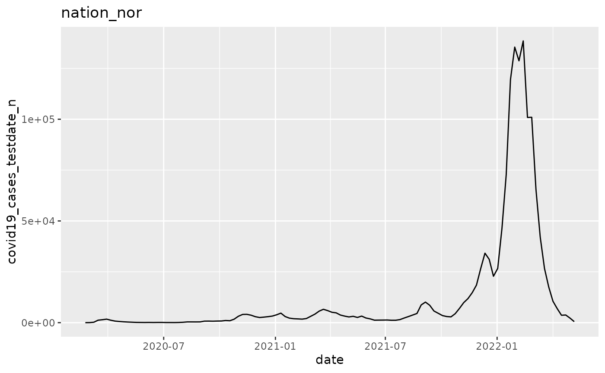

# Adding analyses to a plan

This vignette builds three plans on
`nor_covid19_cases_by_time_location`, a dataset of Covid-19 cases in
Norway.
[`vignette("plnr")`](https://www.rwhite.no/plnr/articles/plnr.md)
defines the terms: argset, action function, analysis and plan.

## Single-function plan

A single-function plan applies one action function to many argsets. Add
the argsets first. Then give every argset the same action function with
`apply_action_fn_to_all_argsets()`.

### Many strata

This plan draws one graph for each location.

``` r
library(ggplot2)
library(data.table)
```

    ## 
    ## Attaching package: 'data.table'

    ## The following object is masked from 'package:base':
    ## 
    ##     %notin%

``` r
p <- plnr::Plan$new()

data_fn <- function() {
  return(plnr::nor_covid19_cases_by_time_location)
}
p$add_data(name = "covid19_cases", fn_name = "data_fn")

location_codes <- unique(p$get_data()$covid19_cases$location_code)
location_codes
```

    ##  [1] "county_nor03" "county_nor11" "county_nor15" "county_nor18" "county_nor30"
    ##  [6] "county_nor34" "county_nor38" "county_nor42" "county_nor46" "county_nor50"
    ## [11] "county_nor54" "nation_nor"

``` r
p$add_argset_from_list(
  plnr::expand_list(
    location_code = location_codes,
    granularity_time = "isoweek"
  )
)
p$get_argsets_as_dt()
```

    ##                            name_analysis index_analysis location_code
    ##                                   <char>          <int>        <list>
    ##  1: 18fbf13c-992c-405b-b6a5-2660db12be7e              1  county_nor03
    ##  2: e83e6340-4e32-4037-b1a1-b86429c19654              2  county_nor11
    ##  3: 460a3a94-f8e5-42e0-afe1-e0ef87dd7ae6              3  county_nor15
    ##  4: b8611429-d68f-4933-841f-da83dfeede5c              4  county_nor18
    ##  5: a5411b48-9dea-44d8-ac32-3ea0356f07ed              5  county_nor30
    ##  6: c298b6e9-a86c-48cf-919f-4f34ae33a9b9              6  county_nor34
    ##  7: da1cc0a2-504c-4319-96df-3a7abb7812e0              7  county_nor38
    ##  8: dcd66642-f298-486a-bdc0-aecf1031e7e2              8  county_nor42
    ##  9: d014280d-0c39-46d4-8d96-0c90746e7a44              9  county_nor46
    ## 10: d0351c32-f6b6-4972-b924-e35bea5cdcd3             10  county_nor50
    ## 11: beab814b-bc98-4d32-af13-dadb388eb449             11  county_nor54
    ## 12: 6f404c4b-298b-4195-bbd5-3b477d035ed2             12    nation_nor
    ##     granularity_time
    ##               <list>
    ##  1:          isoweek
    ##  2:          isoweek
    ##  3:          isoweek
    ##  4:          isoweek
    ##  5:          isoweek
    ##  6:          isoweek
    ##  7:          isoweek
    ##  8:          isoweek
    ##  9:          isoweek
    ## 10:          isoweek
    ## 11:          isoweek
    ## 12:          isoweek

``` r
action_fn <- function(data, argset) {
  if (plnr::is_run_directly()) {
    data <- p$get_data()
    argset <- p$get_argset(1)
  }
  pd <- data$covid19_cases[
    location_code == argset$location_code &
      granularity_time == argset$granularity_time
  ]

  q <- ggplot(pd, aes(x = date, y = covid19_cases_testdate_n))
  q <- q + geom_line()
  q <- q + labs(title = argset$location_code)
  q
}

p$apply_action_fn_to_all_argsets(fn_name = "action_fn")

q <- p$run_all()
q[[1]]
```


``` r
q[[2]]
```


### Many variables

This plan crosses two choices: cases or cases per 100 000 population,
and weekly or daily data. It draws one graph for each of the four
combinations.

``` r
p <- plnr::Plan$new()

data_fn <- function() {
  return(plnr::nor_covid19_cases_by_time_location[location_code == "nation_nor"])
}
p$add_data(name = "covid19_cases", fn_name = "data_fn")

p$add_argset_from_list(
  plnr::expand_list(
    variable = c("covid19_cases_testdate_n", "covid19_cases_testdate_pr100000"),
    granularity_time = c("isoweek", "day")
  )
)
p$get_argsets_as_dt()
```

    ##                           name_analysis index_analysis
    ##                                  <char>          <int>
    ## 1: fbc9e450-2d5f-478f-908c-b5d8efb1145f              1
    ## 2: 498cecc2-14c5-4582-a569-8816a3ecaa46              2
    ## 3: d4e49521-4706-4c2f-bbb1-52d8f72a2508              3
    ## 4: 74cd4733-5a6c-41a4-8088-b80148d85fbc              4
    ##                           variable granularity_time
    ##                             <list>           <list>
    ## 1:        covid19_cases_testdate_n          isoweek
    ## 2:        covid19_cases_testdate_n              day
    ## 3: covid19_cases_testdate_pr100000          isoweek
    ## 4: covid19_cases_testdate_pr100000              day

``` r
action_fn <- function(data, argset) {
  if (plnr::is_run_directly()) {
    data <- p$get_data()
    argset <- p$get_argset(1)
  }
  pd <- data$covid19_cases[granularity_time == argset$granularity_time]

  q <- ggplot(pd, aes(x = date, y = .data[[argset$variable]]))
  q <- q + geom_line()
  q <- q + labs(title = paste(argset$variable, argset$granularity_time))
  q
}

p$apply_action_fn_to_all_argsets(fn_name = "action_fn")

p$run_one(1)
```


``` r
p$run_one(2)
```


``` r
p$run_one(3)
```


``` r
p$run_one(4)
```


## Multi-function plan

A multi-function plan gives each analysis its own action function. This
plan makes the figures of a short report. Figure 1 has its own action
function, and figures 2 and 3 share one.

``` r
p <- plnr::Plan$new()

data_fn <- function() {
  return(plnr::nor_covid19_cases_by_time_location)
}
p$add_data(name = "covid19_cases", fn_name = "data_fn")

figure_1 <- function(data, argset) {
  if (plnr::is_run_directly()) {
    data <- p$get_data()
    argset <- p$get_argset("figure_1")
  }
  pd <- data$covid19_cases[granularity_time == "isoweek"]

  q <- ggplot(pd, aes(x = date, y = covid19_cases_testdate_pr100000))
  q <- q + geom_line()
  q <- q + facet_wrap(~location_code)
  q <- q + labs(title = "Weekly Covid-19 cases per 100 000 population")
  q
}

plot_epicurve_by_location <- function(data, argset) {
  if (plnr::is_run_directly()) {
    data <- p$get_data()
    argset <- p$get_argset("figure_2")
  }
  pd <- data$covid19_cases[
    granularity_time == "isoweek" &
      location_code == argset$location_code
  ]

  q <- ggplot(pd, aes(x = date, y = covid19_cases_testdate_n))
  q <- q + geom_line()
  q <- q + labs(title = argset$location_code)
  q
}

p$add_analysis(name = "figure_1", fn_name = "figure_1")
p$add_analysis(
  name = "figure_2",
  fn_name = "plot_epicurve_by_location",
  location_code = "nation_nor"
)
p$add_analysis(
  name = "figure_3",
  fn_name = "plot_epicurve_by_location",
  location_code = "county_nor03"
)

p$run_one("figure_1")
```


``` r
p$run_one("figure_2")
```



``` r
p$run_one("figure_3")
```


