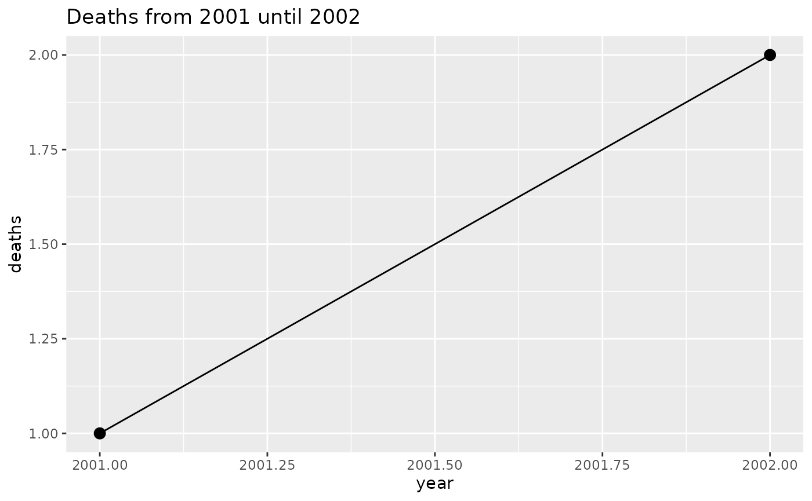

# Introduction to plnr

## Introduction

`plnr` is a framework for planning and executing analyses in R. It’s
designed to help you organize and run multiple analyses efficiently,
whether you’re applying the same function with different arguments or
running multiple different functions on your data.

### Core Concepts

#### Broad technical terms

[TABLE]

#### Different types of plans

|                      |                                                                                                  |
|----------------------|--------------------------------------------------------------------------------------------------|
| **Plan Type**        | **Description**                                                                                  |
| Single-function plan | Same action function applied multiple times with different argsets applied to the same datasets. |
| Multi-function plan  | Different action functions applied to the same datasets.                                         |

#### Plan Examples

|                      |                                                                                                                                                                     |
|----------------------|---------------------------------------------------------------------------------------------------------------------------------------------------------------------|
| **Plan Type**        | **Example**                                                                                                                                                         |
| Single-function plan | Multiple strata (e.g. locations, age groups) that you need to apply the same function to to (e.g. outbreak detection, trend detection, graphing).                   |
| Single-function plan | Multiple variables (e.g. multiple outcomes, multiple exposures) that you need to apply the same statistical methods to (e.g. regression models, correlation plots). |
| Multi-function plan  | Creating the output for a report (e.g. multiple different tables and graphs).                                                                                       |

### Basic Usage

Let’s start with a simple example that demonstrates the core concepts:

``` r
library(plnr)
```

    ## plnr 2026.8.3
    ## https://www.rwhite.no/plnr/

``` r
library(ggplot2)
library(data.table)
```

    ## 
    ## Attaching package: 'data.table'

    ## The following object is masked from 'package:base':
    ## 
    ##     %notin%

``` r
# Create a new plan
p <- Plan$new()

# Add data
p$add_data(
  name = "deaths",
  direct = data.table(deaths=1:4, year=2001:2004)
)

# Add argsets for different years
p$add_argset(
  name = "fig_1_2002",
  year_max = 2002
)

p$add_argset(
  name = "fig_1_2003",
  year_max = 2003
)

# Define analysis function
fn_fig_1 <- function(data, argset) {
  plot_data <- data$deaths[year <= argset$year_max]
  
  ggplot(plot_data, aes(x=year, y=deaths)) +
    geom_line() +
    geom_point(size=3) +
    labs(title = glue::glue("Deaths from 2001 until {argset$year_max}"))
}

# Apply function to all argsets
p$apply_action_fn_to_all_argsets(fn_name = "fn_fig_1")

# Run analyses
p$run_one("fig_1_2002")
```



### Advanced Features

#### Data Management

The framework ensures efficient data management by: - Loading data once
and reusing across analyses - Separating data cleaning from analysis -
Providing hash-based tracking of data changes

#### Debugging Tools

`plnr` includes several tools to help with development and debugging:

``` r
# Access data directly
p$get_data()
```

    ## $deaths
    ##    deaths  year
    ##     <int> <int>
    ## 1:      1  2001
    ## 2:      2  2002
    ## 3:      3  2003
    ## 4:      4  2004
    ## 
    ## $hash
    ## $hash$current
    ## [1] "1e95d7e0bebc100ba24647f2b28f429e"
    ## 
    ## $hash$current_elements
    ## $hash$current_elements$deaths
    ## [1] "c9e30a8d0af2d4d284347ce8c275e2b9"

``` r
# Access specific argset
p$get_argset("fig_1_2002")
```

    ## $year_max
    ## [1] 2002

``` r
# Access analysis by name or index
p$get_analysis(1)
```

    ## $argset
    ## $argset$year_max
    ## [1] 2002
    ## 
    ## $argset$index_analysis
    ## [1] 1
    ## 
    ## 
    ## $fn_name
    ## [1] "fn_fig_1"

``` r
# Use is_run_directly() for development
fn_analysis <- function(data, argset) {
  if(plnr::is_run_directly()) {
    data <- p$get_data()
    argset <- p$get_argset("fig_1_2002")
  }
  
  # function continues here
}
```

#### Function Naming

When adding analyses, you can use either `fn_name` or `fn`:

``` r
# Using fn_name (recommended)
p$add_analysis(
  name = "fig_1_2002",
  fn_name = "fn_fig_1",
  year_max = 2002
)

# Using fn (for function factories)
p$add_analysis(
  name = "fig_1_2003",
  fn = fn_fig_1,
  year_max = 2003
)
```

#### Hash-based Caching

The framework uses hashing to track data changes:

``` r
# Create two plans with same data
p1 <- Plan$new()
p1$add_data(direct = data.table(deaths=1:4, year=2001:2004), name = "deaths")
p1$add_data(direct = data.table(deaths=1:4, year=2001:2004), name = "deaths2")

p2 <- Plan$new()
p2$add_data(direct = data.table(deaths=1:4, year=2001:2004), name = "deaths")
p2$add_data(direct = data.table(deaths=1:4, year=2001:2004), name = "deaths2")

# Same data has same hash
identical(p1$get_data()$hash$current_elements, p2$get_data()$hash$current_elements)
```

    ## [1] TRUE

``` r
# Different data has different hash
p1$add_data(direct = data.table(deaths=1:5, year=2001:2005), name = "deaths3")
p1$get_data()$hash$current_elements
```

    ## $deaths
    ## [1] "c9e30a8d0af2d4d284347ce8c275e2b9"
    ## 
    ## $deaths2
    ## [1] "c9e30a8d0af2d4d284347ce8c275e2b9"
    ## 
    ## $deaths3
    ## [1] "3840cef6dc64a556e25ff652446512d0"

### Best Practices

1.  **Data Organization**
    - Keep data cleaning separate from analysis
    - Use meaningful names for datasets
    - Document data structure and assumptions
2.  **Analysis Functions**
    - Always accept `data` and `argset` parameters
    - Use
      [`is_run_directly()`](https://www.rwhite.no/plnr/reference/is_run_directly.md)
      for development
    - Keep functions focused and single-purpose
3.  **Plan Structure**
    - Use meaningful names for argsets and analyses
    - Group related analyses together
    - Document plan structure and dependencies
4.  **Development Workflow**
    - Start with small examples
    - Use debugging tools during development
    - Test analyses individually before running full plan

### Next Steps

1.  Read the [Adding
    Analyses](https://www.rwhite.no/plnr/articles/adding_analyses.html)
    vignette for more detailed examples
2.  Check out the [package website](https://www.rwhite.no/plnr/) for
    additional resources
3.  Explore the function documentation with
    [`help(package="plnr")`](https://www.rwhite.no/plnr/reference)
